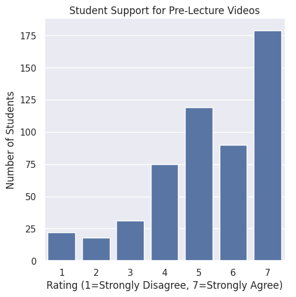
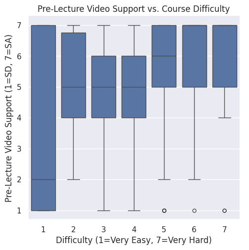
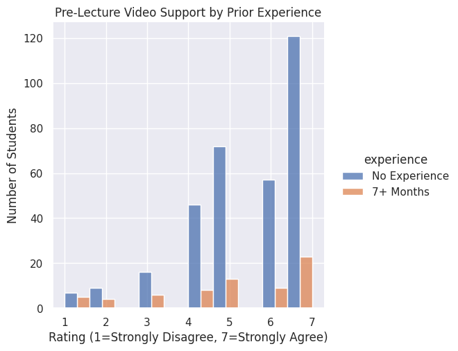

---
# Do not edit the text between these lines!
layout: default
---

# This website was created for COMP110 exercise 09.

<!-- This is a comment. Below, you'll see code for inserting an image. To make this image appear, update <custom-path>. To add an image, save it inside the imgs folder of this repository. -->

## We analyzed data from the course to assess whether pre-lecture videos would be helpful for students. We created three charts that helped us determine that pre-lecture videos would likely serve as a helpful learning tool for COMP110 students.

## Chart 1
We first looked at how the entire sample of students rated the idea of pre-lecture videos.

The spread of support was the following: 
22 students reported a 1
18 students reported a 2
31 students reported a 3
75 students reported a 4
119 students reported a 5
90 students reported a 6
179 students reported a 7

## Evidence shows that the vast majority of the student sample supports pre-lecture videos as a learning tool to improve the class.

## Chart 2
We investigated whether students who find the course more difficult are also more likely to support pre-lecture videos using a box plot.

## The plot signifies that students who find the class harder are more likely to support pre-lecture videos.

## Chart 3
We compared how students with no prior programming experience rate pre-lecture videos versus students with 7+ months of experience. This was achieved through the following histogram.

## It appears that students with no experience support pre-lecture videos more strongly. However, it is hard to decipher without statistical analyses (i.e. linear regression).

## Conclusion
In this analysis, we examined whether pre-lecture videos would be a useful tool for future COMP110 students. For our first analysis, we looked into how the entire sample of students supported pre-lecture videos as a tool for learning in this class. The vast majority of the sample reported a 5, 6, or 7. This indicated substantial support for pre-lecture videos.

Our second analysis looked at whether students who found the class harder support pre-lecture videos as a learning tool more prevalently. Our hypothesis was correct, in that we found that students who find the class harder are more likely to endorse pre-lecture videos. Our last analysis investigated how students with no prior programming experience rate pre-lecture videos versus students with 7+ months of experience. The plot seems to show us that students with no prior experience are more likely to support pre-lecture videos. However, this plot is limited in its ability to tell us whether there is a meaningful difference in the prevalence of students with no prior experience supporting pre-lecture videos as compared to students with 7+ months of experience.

Overall, our analyses support the notion that pre-lecture videos would be useful in students' learning. Generally, over half of the student sample endorsed pre-lecture videos. Additionally, we see that students who percieve the class to be more difficult are more likely to support pre-lecture videos. This means that pre-lecture videos may effectively help students who are struggling more in the class. With better support for students who are struggling in the class more, COMP110 would significantly improve as a course.

Pre-lecture videos would take up extra time and resources from instructors and TA's. TA's already spend significant amounts of time in office hours and tutoring; adding another responsibility onto their workload (recording pre-lecture videos) may exacerbate tehm, decreasing the quality of their help. Further, adding pre-lecture videos to students' workload may contribute to burnout. Students already can often feel overworked and burnt out from classes. There is always an inherent risk for burn out in students when giving them more regular work.

A refinement of the pre-lecture videos that may combat student burn-out is making sure that the pre-lecture videos are under 15 minutes. Shorter "bite-sized" videos overviewing the content of the lecture will effectively prepare students without overwhelming them. An extension to pre-lecture videos that would prove useful is small (5ish question) optional quizzes that ask about necessary information needed for the lecture. This quiz may be review of previous classes, terminology necessary for the upcoming class, or a small practice problem. An optional pre-lecture quiz paired with the video will sufficiently prepare students for class, allowing them to better soak in the more complex content from lecture.

To assess whether short pre-lecture videos and quizzes help, it would be helpful to survey students during a year in which these lectures and quizzes are available. Adding a survey question about if/how often students watch the videos and take the quizzes, as well as gathering data about their grades, will provide the COMP110 team with the data needed to understand how the quizzes and videos may help.